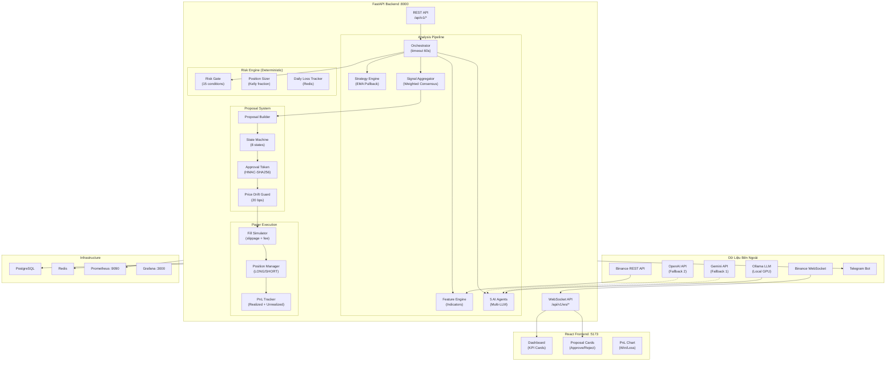
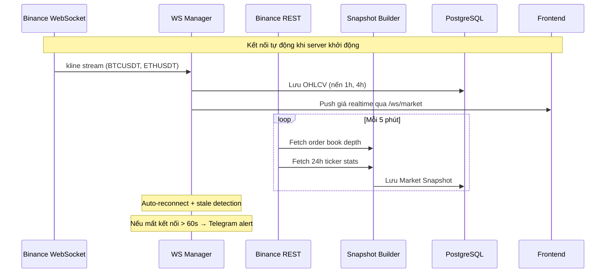
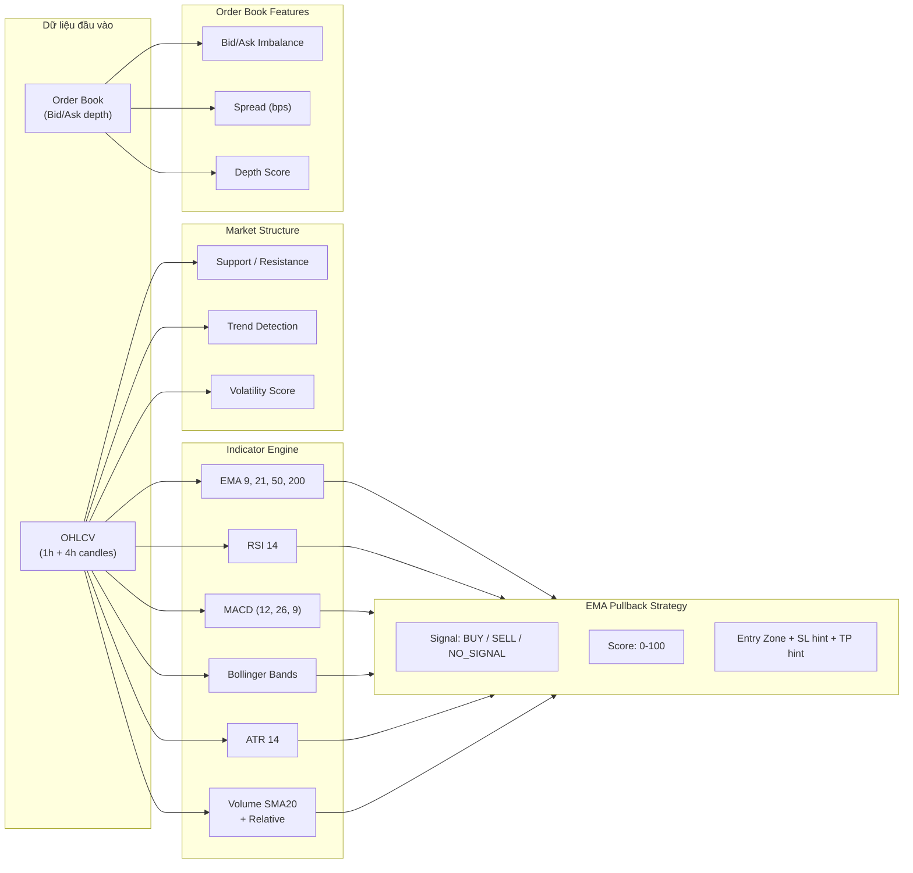
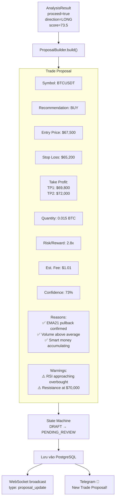
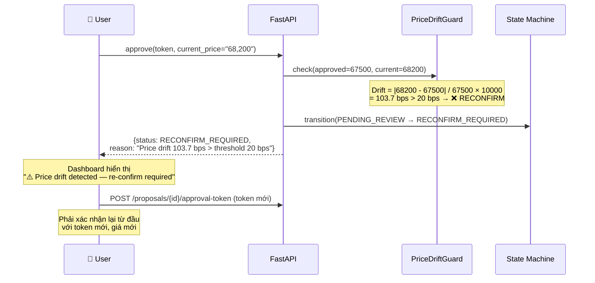
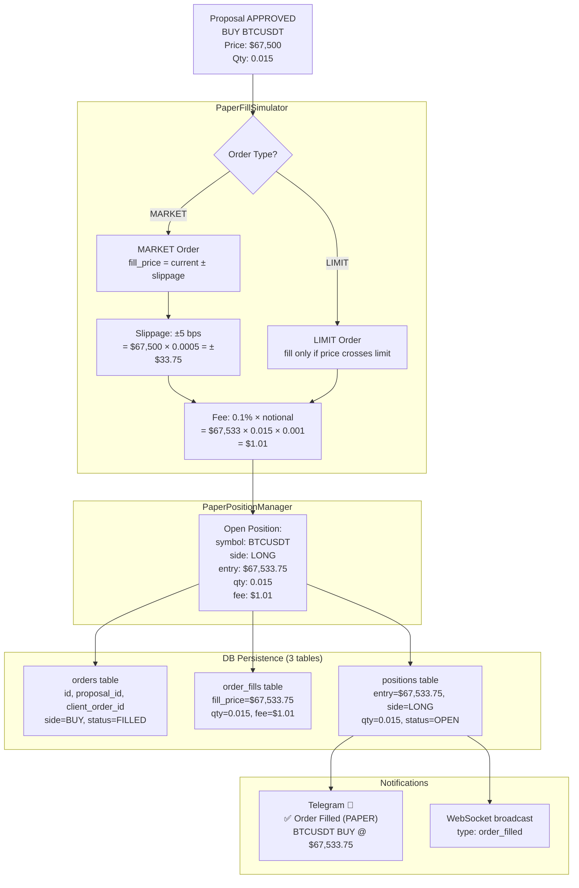
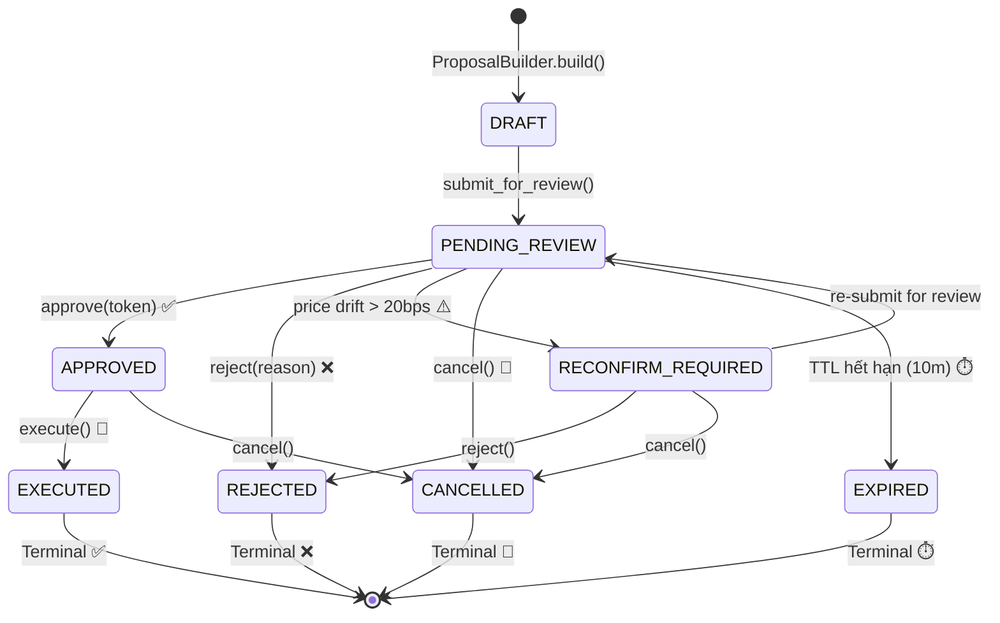
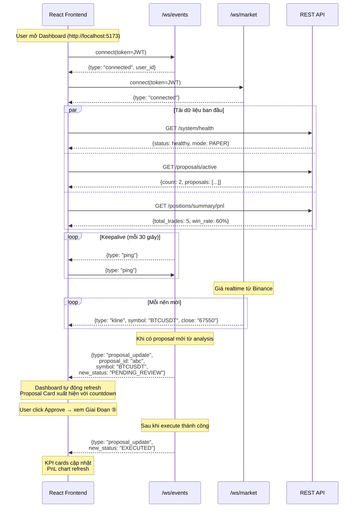

# ACTA — Luồng Hoạt Động Toàn Hệ Thống

> **A**gentic **C**rypto **T**rading **A**dvisor
>
> _"Agents phân tích. Agents tư vấn. **Con người quyết định.**"_

---

## 1. Kiến Trúc Tổng Thể



---

## 2. Luồng Chính: Từ Dữ Liệu Thị Trường → Giao Dịch

Toàn bộ quy trình hoạt động qua **6 giai đoạn liên tiếp**:

```
┌─────────────┐    ┌──────────────┐    ┌──────────────┐    ┌──────────────┐    ┌──────────────┐    ┌──────────────┐
│  ① Thu thập  │ → │ ② Tính toán  │ → │ ③ 5 AI Agents│ → │ ④ Tạo đề    │ → │ ⑤ Con người  │ → │ ⑥ Thực thi   │
│  dữ liệu    │    │  đặc trưng   │    │  phân tích   │    │  xuất giao  │    │  phê duyệt   │    │  Paper Trade │
│  thị trường  │    │  (Features)  │    │  thị trường  │    │  dịch       │    │              │    │  + PnL       │
└─────────────┘    └──────────────┘    └──────────────┘    └──────────────┘    └──────────────┘    └──────────────┘
     Phase 1            Phase 2             Phase 4             Phase 5             Phase 5            Phase 6
```

---

## 3. Giai Đoạn ①: Thu Thập Dữ Liệu Thị Trường (Phase 1)



### Dữ liệu thu thập:

| Loại | Nguồn | Tần suất | Mục đích |
|------|-------|----------|----------|
| OHLCV (nến 1h, 4h) | Binance WebSocket | Realtime (mỗi nến) | Input cho Indicators |
| Order Book Depth | Binance REST | Mỗi 5 phút | Bid/Ask Imbalance, Spread |
| 24h Ticker Stats | Binance REST | Mỗi 5 phút | Volume 24h, Price Change |
| Giá realtime | Binance WebSocket | Mỗi giây | Push tới Frontend |

### Files chính:

| File | Chức năng |
|------|-----------|
| `app/market_data/binance_ws.py` | WebSocket kline stream, auto-reconnect, ping/pong |
| `app/market_data/binance_rest.py` | REST client (httpx async + rate limit) |
| `app/market_data/snapshot_builder.py` | Tổng hợp dữ liệu thị trường thành snapshot |
| `app/market_data/data_validator.py` | Phát hiện dữ liệu bất thường, stale, gap |

---

## 4. Giai Đoạn ②: Tính Toán Đặc Trưng (Phase 2)



### Chiến lược EMA Pullback:

```
IF trend_1h == BULLISH AND trend_4h == BULLISH:
    IF price pullback to EMA21 zone:
        IF RSI > 40 AND MACD histogram rising:
            IF volume > average:
                → signal = BUY, score = 65-85

IF trend_1h == BEARISH AND trend_4h == BEARISH:
    IF price bounce to EMA21 zone:
        IF RSI < 60 AND MACD histogram falling:
            IF volume > average:
                → signal = SELL, score = 65-85

Else:
    → signal = NO_SIGNAL, score = 0
```

### Files chính:

| File | Chức năng |
|------|-----------|
| `app/features/engine.py` | FeatureEngine: compute + store 50+ indicators |
| `app/features/indicators.py` | EMA, RSI, MACD, BB, ATR calculations |
| `app/features/volume.py` | Volume SMA20, Relative Volume |
| `app/features/market_structure.py` | Support/Resistance, Trend detection |
| `app/features/orderbook_features.py` | Imbalance, Spread, Depth |
| `app/strategies/ema_pullback.py` | Rule-based entry strategy |
| `app/strategies/registry.py` | Strategy registry (extensible) |

---

## 5. Giai Đoạn ③: Pipeline Phân Tích Multi-Agent (Phase 3 + 4)

Đây là **trái tim** của hệ thống — 5 agent AI phân tích song song, sau đó aggregator tổng hợp, rồi critic đánh giá cuối cùng.

```mermaid
sequenceDiagram
    participant TRIGGER as Trigger<br/>(Manual / Cron 15m)
    participant ORCH as Orchestrator
    participant FEAT as Feature Engine
    participant STRAT as Strategy Engine
    participant RISK as Risk Gate
    participant MR as Market Regime<br/>Agent
    participant TA as Technical<br/>Agent
    participant OF as Order Flow<br/>Agent
    participant RA as Risk Analysis<br/>Agent
    participant AGG as Signal<br/>Aggregator
    participant CR as Critic<br/>Agent

    TRIGGER->>ORCH: analyze("BTCUSDT")

    Note over ORCH: timeout = 60 giây

    rect rgb(30, 40, 60)
        Note over ORCH,FEAT: Step 1: Tính đặc trưng
        ORCH->>FEAT: compute_and_store("BTCUSDT")
        FEAT-->>ORCH: features dict (50+ indicators)
    end

    rect rgb(30, 40, 60)
        Note over ORCH,STRAT: Step 2: Chiến lược rule-based
        ORCH->>STRAT: evaluate("ema_pullback", features)
        STRAT-->>ORCH: signal=BUY, score=75
    end

    rect rgb(40, 30, 30)
        Note over ORCH,RISK: Step 3: Risk Gate pre-check (15 conditions)
        ORCH->>RISK: assess(context)
        RISK-->>ORCH: allowed=true, position_size=0.015, stop_loss=$65,200
    end

    rect rgb(30, 50, 40)
        Note over ORCH,OF: Step 4: 3 Agents chạy ĐỒNG THỜI (asyncio.gather)
        par Chạy song song
            ORCH->>MR: LLM → "Phân tích chế độ thị trường"
            MR-->>ORCH: regime=TRENDING_BULLISH
        and Chạy song song
            ORCH->>TA: LLM → "Phân tích kỹ thuật"
            TA-->>ORCH: direction=LONG, confidence=0.72
        and Chạy song song
            ORCH->>OF: LLM → "Phân tích dòng lệnh"
            OF-->>ORCH: bias=BULLISH, smart_money=ACCUMULATING
        end
    end

    rect rgb(40, 30, 30)
        Note over ORCH,RA: Step 5: Risk Analysis Agent (cần output Step 4)
        ORCH->>RA: LLM → "Đánh giá rủi ro" + regime context
        RA-->>ORCH: risk_level=MODERATE, max_position=0.1 BTC
    end

    rect rgb(30, 40, 60)
        Note over ORCH,AGG: Step 6: Tổng hợp tín hiệu (weighted consensus)
        ORCH->>AGG: aggregate(regime + tech + flow + risk + strategy)
        AGG-->>ORCH: direction=LONG, consensus=73.5, actionable=true
    end

    rect rgb(50, 40, 30)
        Note over ORCH,CR: Step 7: Critic phản biện (adversarial)
        ORCH->>CR: LLM → "Tìm điểm yếu trong phân tích này"
        CR-->>ORCH: proceed=true, objections=["RSI gần overbought"]
    end

    ORCH-->>TRIGGER: AnalysisResult{proceed=true, direction=LONG, score=73.5}
```



### Chi tiết 5 AI Agents:

| # | Agent | Vai trò | Input | Output |
|---|-------|---------|-------|--------|
| 1 | **Market Regime** | Xác định chế độ thị trường | Features + OHLCV | `TRENDING_BULLISH` / `RANGING` / `VOLATILE` |
| 2 | **Technical** | Phân tích kỹ thuật chi tiết | Features + Strategy signal | `LONG` / `SHORT` / `NEUTRAL` + confidence |
| 3 | **Order Flow** | Phân tích dòng lệnh | Order book + Volume | `BULLISH` / `BEARISH` + smart_money indicator |
| 4 | **Risk Analysis** | Đánh giá mức rủi ro | Risk context + Regime | risk_level + max position size |
| 5 | **Critic** | Phản biện, tìm điểm yếu | Tất cả output trên | `proceed=true/false` + objections[] |

### Trọng số Aggregator (có thể cấu hình):

```
Market Regime : 22%
Technical     : 33%    ← ưu tiên cao nhất
Order Flow    : 22%
Risk Analysis : 12%
Critic        : 11%
```

### Fallback Chain cho LLM:

```
┌──────────────┐     ┌──────────────┐     ┌──────────────┐
│   Ollama     │ ──→ │  Gemini API  │ ──→ │ OpenAI API   │
│  (local GPU) │     │  (fallback)  │     │  (fallback)  │
│   Miễn phí   │     │  $0.10/1M    │     │  $0.15/1M    │
│  2-10s delay │     │  1-3s delay  │     │  1-3s delay  │
└──────────────┘     └──────────────┘     └──────────────┘
```

### 15 Risk Gate Conditions:

```
 1. Signal score >= min_threshold (60)
 2. Risk/Reward ratio >= min (1.5x)
 3. Spread <= max (50 bps)
 4. Volume relative > min (0.5x)
 5. Daily loss < max (2.5%)
 6. Open positions < max (5)
 7. Total exposure < max (50%)
 8. Market data not stale
 9. Exchange connected
10. Trading mode allows execution
11. Position size > 0
12. Notional >= exchange min ($10)
13. Account balance sufficient
14. ATR > 0 (volatility exists)
15. Stop loss valid (> 0)
```

### Files chính:

| File | Chức năng |
|------|-----------|
| `app/agents/orchestrator.py` | Pipeline 7 bước, timeout 60s |
| `app/agents/llm_client.py` | Multi-provider LLM (Ollama → Gemini → OpenAI) |
| `app/agents/signal_aggregator.py` | Weighted consensus scoring |
| `app/agents/market_regime_agent.py` | Regime detection agent (LLM) |
| `app/agents/technical_agent.py` | Technical analysis agent (LLM) |
| `app/agents/order_flow_agent.py` | Order flow analysis agent (LLM) |
| `app/agents/risk_analysis_agent.py` | Risk assessment agent (LLM) |
| `app/agents/critic_agent.py` | Adversarial critic agent (LLM) |
| `app/risk/engine.py` | Risk Gate (15 conditions) |
| `app/risk/position_sizer.py` | Kelly fraction position sizing |
| `app/risk/daily_tracker.py` | Daily loss tracking (Redis) |

---

## 6. Giai Đoạn ④: Tạo Đề Xuất Giao Dịch (Phase 5)

Khi Orchestrator trả về `proceed_to_proposal = true`, hệ thống tự động tạo Proposal:



### Nội dung Proposal chi tiết:

| Trường | Ví dụ | Nguồn |
|--------|-------|-------|
| `symbol` | BTCUSDT | Input |
| `recommendation` | BUY | Aggregator direction |
| `suggested_price` | $67,500 | Current market price |
| `suggested_quantity` | 0.015 BTC | Risk Engine position sizer |
| `stop_loss_price` | $65,200 | Risk Engine (ATR-based) |
| `take_profit_prices` | TP1: $69,800, TP2: $72,000 | Risk/Reward ratio |
| `risk_reward_ratio` | 2.8x | Calculated |
| `estimated_fee` | $1.01 | Fee estimator |
| `confidence` | 73% | Aggregator consensus_score |
| `supporting_reasons[]` | ["EMA21 pullback", ...] | Agents + Strategy |
| `risk_warnings[]` | ["RSI overbought", ...] | Critic + Risk Agent |
| `agent_consensus` | {regime: BULL, tech: LONG, ...} | All agents |
| `expires_at` | +10 minutes | Configurable TTL |

### Proposal có **thời hạn 10 phút** (configurable):
- Nếu không approve trong 10 phút → State Machine tự động chuyển sang `EXPIRED`
- Job `ProposalExpirationService` chạy mỗi 60 giây kiểm tra
- Expired proposals sẽ không bao giờ có thể approve

---

## 7. Giai Đoạn ⑤: Con Người Phê Duyệt (Phase 5 — Quan Trọng Nhất)

Đây là bước **human-in-the-loop** — không có proposal nào được thực thi mà không có sự phê duyệt rõ ràng.

```mermaid
sequenceDiagram
    participant USER as 👤 User (Dashboard)
    participant API as FastAPI
    participant TOKEN_MGR as ApprovalTokenManager
    participant SM as State Machine
    participant DRIFT as PriceDriftGuard
    participant EXEC as Execution Service
    participant WS as WebSocket
    participant TG as Telegram

    Note over USER: Thấy Proposal Card trên Dashboard<br/>với countdown 10 phút

    USER->>API: POST /proposals/{id}/approval-token
    API->>TOKEN_MGR: issue(proposal, user_id, ttl=30s)

    Note over TOKEN_MGR: HMAC-SHA256 signing<br/>Binds: proposal_id + user_id +<br/>payload_hash + expiry
    TOKEN_MGR-->>API: token (valid 30 giây)
    API-->>USER: {token: "abc...", expires_in: 30}

    Note over USER: Popup xác nhận xuất hiện<br/>Countdown 30s bắt đầu<br/>Nhập current market price

    USER->>API: POST /proposals/{id}/approve<br/>{token, current_price: "67,550"}

    rect rgb(50, 30, 30)
        Note over API,DRIFT: 5 bước kiểm tra an ninh
        API->>TOKEN_MGR: validate(token, proposal, user_id)
        Note over TOKEN_MGR: ✅ 1. Chữ ký HMAC hợp lệ?
        Note over TOKEN_MGR: ✅ 2. Token chưa hết hạn? (< 30s)
        Note over TOKEN_MGR: ✅ 3. Token chưa sử dụng? (one-time)
        Note over TOKEN_MGR: ✅ 4. Payload hash khớp? (price/qty không bị đổi)
        Note over TOKEN_MGR: ✅ 5. User ID khớp?

        TOKEN_MGR-->>API: valid=true
        TOKEN_MGR->>TOKEN_MGR: consume(token) — đánh dấu đã dùng

        API->>DRIFT: check(approved_price=67500, current=67550)
        Note over DRIFT: Drift = |67550 - 67500| / 67500 × 10000 = 7.4 bps
        Note over DRIFT: 7.4 bps < 20 bps threshold → OK ✅
        DRIFT-->>API: requires_reconfirm=false
    end

    API->>SM: transition(PENDING_REVIEW → APPROVED)
    SM-->>API: ✅ State = APPROVED

    API->>EXEC: execute_and_persist(proposal, current_price)
    Note over EXEC: Paper trade execution (xem Giai Đoạn ⑥)
    EXEC-->>API: {order_id, position_id, fill_price}

    API->>SM: transition(APPROVED → EXECUTED)

    API->>WS: broadcast("proposal_update", status=EXECUTED)
    API->>TG: "✅ Order Filled (PAPER)"
    API-->>USER: {status: EXECUTED, fill_price: 67,553.20}
```



### Khi Price Drift vượt ngưỡng (> 20 bps):



### Khi User chọn Reject:

```
User click [❌ Reject] → POST /proposals/{id}/reject
  → State Machine: PENDING_REVIEW → REJECTED (terminal)
  → WebSocket broadcast: proposal_update
  → Telegram: "❌ Proposal BTCUSDT BUY rejected"
  → Proposal không thể recover
```

### Token Security — Tóm tắt:

| Loại tấn công | Cách phòng thủ | Kết quả |
|----------------|----------------|---------|
| **Replay** — dùng lại token cũ | Token one-time use, `consumed` flag | ❌ Blocked |
| **Tampering** — sửa nội dung token | HMAC-SHA256 signature verification | ❌ Blocked |
| **Escalation** — user khác dùng | user_id bound vào token payload | ❌ Blocked |
| **Price manipulation** — đổi giá sau approve | payload_hash covers price+qty+SL | ❌ Blocked |
| **Timing attack** — đoán signature | `hmac.compare_digest()` constant-time | ❌ Blocked |
| **Expired token** — dùng token quá hạn | TTL 30 giây, kiểm tra expiry | ❌ Blocked |

---

## 8. Giai Đoạn ⑥: Thực Thi Paper Trade (Phase 6)



### PnL Calculations (tất cả dùng `Decimal` — không bao giờ dùng `float` cho tiền):

```python
# ══════════════════════════════════════════════════════════
# LONG position (BUY → mong giá tăng)
# ══════════════════════════════════════════════════════════
gross_pnl = (exit_price - entry_price) × quantity
# Ví dụ: ($69,000 - $67,533.75) × 0.015 = $22.00

net_pnl = gross_pnl - entry_fee - exit_fee
# Ví dụ: $22.00 - $1.01 - $1.04 = $19.95

return_pct = net_pnl / (entry_price × quantity) × 100
# Ví dụ: $19.95 / ($67,533.75 × 0.015) × 100 = 1.97%

# ══════════════════════════════════════════════════════════
# SHORT position (SELL → mong giá giảm)
# ══════════════════════════════════════════════════════════
gross_pnl = (entry_price - exit_price) × quantity

# ══════════════════════════════════════════════════════════
# Aggregated Metrics
# ══════════════════════════════════════════════════════════
win_rate      = winning_trades / total_trades × 100
profit_factor = sum(gross_wins) / abs(sum(gross_losses))
max_drawdown  = min(running_equity_curve)
```

### Execution Flow — Client Order ID:

```
Format: ACTA-{proposal_id[:8]}-{random_hex[:6]}
Ví dụ:  ACTA-a3b2c1d4-F7E2A1
```

Unique cho mỗi lần execute, đảm bảo idempotency.

### Files chính:

| File | Chức năng |
|------|-----------|
| `app/execution/service.py` | PaperExecutionService (sync) + Async version |
| `app/execution/paper_fill.py` | MARKET/LIMIT fill simulation + slippage |
| `app/execution/position_manager.py` | Open/Close LONG+SHORT, unrealized PnL |
| `app/execution/pnl_tracker.py` | Aggregated metrics: win rate, profit factor, drawdown |

---

## 9. Proposal State Machine (Phase 5)



### Transition Rules:

| From State | To State | Trigger | Ai thực hiện |
|------------|----------|---------|-------------|
| DRAFT | PENDING_REVIEW | Proposal vừa tạo | Hệ thống tự động |
| PENDING_REVIEW | APPROVED | User approve + token valid | User qua Dashboard |
| PENDING_REVIEW | REJECTED | User reject | User qua Dashboard |
| PENDING_REVIEW | RECONFIRM_REQUIRED | Price drift > 20bps | Hệ thống tự động |
| PENDING_REVIEW | EXPIRED | Hết 10 phút | ExpirationService (cron) |
| PENDING_REVIEW | CANCELLED | User cancel | User qua Dashboard |
| RECONFIRM_REQUIRED | PENDING_REVIEW | User re-submit | User qua Dashboard |
| APPROVED | EXECUTED | Paper trade filled | Hệ thống tự động |
| APPROVED | CANCELLED | User cancel trước khi execute | User qua Dashboard |

---

## 10. Real-Time Dashboard (Phase 7)



### Dashboard Components:

| Component | Chức năng | Dữ liệu |
|-----------|-----------|----------|
| **KPI Cards** (4 cards) | System status, Mode, Active Proposals, Total PnL | REST API + auto-refresh 30s |
| **ProposalCard** | Approve/Reject flow với 30s countdown | REST API + WebSocket events |
| **PnLChart** | Win/Loss bar + performance stats | REST API: `/positions/summary/pnl` |
| **Sidebar** | Navigation + WS connection indicator | WebSocket state |

---

## 11. Module Isolation — Ranh Giới Import (Phase 8)

Hệ thống enforce **ranh giới import nghiêm ngặt** để đảm bảo an toàn:

```
                    ┌──────────────────┐
                    │    API Layer     │
                    │  (api/v1/*.py)   │
                    └───────┬──────────┘
                            │ calls
               ┌────────────┼────────────┐
               ▼            ▼            ▼
        ┌────────────┐ ┌──────────┐ ┌──────────────┐
        │ Proposals  │ │ Analysis │ │  Execution   │
        │ Service    │ │   API    │ │   Service    │
        └─────┬──────┘ └────┬─────┘ └──────┬───────┘
              │             │              │
              │             ▼              │
              │      ┌────────────┐        │
              │      │Orchestrator│        │
              │      └─────┬──────┘        │
              │            │               │
              │            ▼               │
              │      ┌────────────┐        │
              │      │  5 Agents  │        │
              │      │  (LLM)    │        │
              │      └────────────┘        │
              │                            │
              │      ╔════════════╗        │
              │      ║  FIREWALL  ║        │
              │      ║            ║        │
              │      ║ Execution  ║        │
              │      ║  ✕ Agents  ║        │
              │      ║            ║        │
              │      ║ Agents     ║        │
              │      ║  ✕ Exec    ║        │
              │      ╚════════════╝        │
              │                            │
              ▼                            ▼
        ┌────────────┐            ┌──────────────┐
        │Risk Engine │            │ Fill Simulator│
        │(determ.)   │            │ Position Mgr  │
        └────────────┘            └──────────────┘
```

### 9 Import Rules (enforced by CI):

| # | Module | Không được import | Lý do |
|---|--------|-------------------|-------|
| 1 | `execution/` | `from app.agents` | AI không thể tự execute |
| 2 | `execution/` | `import app.agents` | AI không thể tự execute |
| 3 | `agents/` | `from app.execution` | Agent không thể tự trade |
| 4 | `agents/` | `import app.execution` | Agent không thể tự trade |
| 5 | `proposals/` | `from app.agents` | Decoupled qua API |
| 6 | `proposals/` | `import app.agents` | Decoupled qua API |
| 7 | `risk/` | `from app.agents` | Risk engine thuần deterministic |
| 8 | `risk/` | `import app.agents` | Risk engine thuần deterministic |
| 9 | `risk/` | `from app.proposals` | One-way data flow |

> Kiểm tra: `python scripts/check_import_boundaries.py` — chạy trong CI pipeline.

---

## 12. Graceful Shutdown (Phase 8)

```
SIGTERM / SIGINT received
    │
    ├── 1. Broadcast "server_shutdown" → tất cả WS clients
    │      → Frontend nhận và hiển thị "Reconnecting..."
    │
    ├── 2. Stop Binance WebSocket
    │      → Ngừng nhận market data
    │
    ├── 3. Close Binance REST client
    │      → Close httpx sessions
    │
    ├── 4. Close Telegram service
    │      → Flush pending messages
    │
    ├── 5. Close PostgreSQL connections
    │      → Drain connection pool
    │
    └── 6. Log "application_stopped, clean=True"
```

> Mỗi bước có `try/except` riêng — nếu một bước fail, các bước còn lại vẫn chạy.

---

## 13. Monitoring & Observability

```
┌───────────────────────────────────────────────────────────────┐
│                        Grafana :3000                          │
├───────────────┬───────────────────┬───────────────────────────┤
│ System Health │  LLM Cost         │  Trading Performance      │
│               │                   │                           │
│ • System Up   │ • Cost today ($)  │ • Proposals created/day   │
│ • WS clients  │ • Tokens used     │ • Approve/Reject ratio    │
│ • API rate    │ • Agent P95 time  │ • Win rate                │
│ • Error rate  │ • Provider pie    │ • Net PnL                 │
│ • P95 latency │ • Fallback rate   │ • Max drawdown            │
│ • Binance WS  │ • Monthly est.    │ • Daily loss vs limit     │
│ • Risk blocks │                   │                           │
└───────────────┴───────────────────┴───────────────────────────┘
         ▲                 ▲                    ▲
         │                 │                    │
    Prometheus :9090 (scrape /metrics mỗi 15s)
         ▲
         │
    FastAPI /metrics endpoint
    (prometheus_fastapi_instrumentator)
```

### Prometheus Metrics chính:

| Metric | Type | Mô tả |
|--------|------|-------|
| `acta_system_up` | Gauge | Hệ thống đang chạy (1) hay không (0) |
| `acta_binance_ws_connected` | Gauge | WebSocket Binance đang kết nối |
| `acta_proposals_created_total` | Counter | Tổng proposals tạo (by symbol) |
| `acta_proposals_approved_total` | Counter | Tổng proposals được approve |
| `acta_proposals_rejected_total` | Counter | Tổng proposals bị reject |
| `acta_proposals_active` | Gauge | Proposals đang chờ review |
| `acta_risk_gate_rejections_total` | Counter | Bị risk gate chặn |
| `acta_agent_workflow_duration_seconds` | Histogram | Thời gian chạy analysis |
| `acta_llm_tokens_total` | Counter | Tổng tokens LLM sử dụng |
| `acta_llm_cost_usd_total` | Counter | Chi phí LLM tích lũy |
| `acta_daily_loss_percent` | Gauge | Thua lỗ trong ngày (%) |

---

## 14. REST API Endpoints

### Authentication

| Method | Path | Mô tả |
|--------|------|-------|
| POST | `/api/v1/auth/login` | Đăng nhập (email + password + MFA) |
| POST | `/api/v1/auth/register` | Đăng ký tài khoản |
| POST | `/api/v1/auth/refresh` | Refresh JWT token |
| POST | `/api/v1/auth/logout` | Đăng xuất |
| POST | `/api/v1/auth/mfa/setup` | Thiết lập TOTP 2FA |

### Market Data

| Method | Path | Mô tả |
|--------|------|-------|
| GET | `/api/v1/market/{symbol}/klines` | OHLCV candle data |
| GET | `/api/v1/market/{symbol}/ticker` | Giá hiện tại + 24h stats |
| GET | `/api/v1/market/{symbol}/orderbook` | Order book depth |

### Analysis

| Method | Path | Mô tả |
|--------|------|-------|
| POST | `/api/v1/analysis/{symbol}/trigger` | Trigger analysis (async) |
| POST | `/api/v1/analysis/{symbol}/trigger-sync` | Trigger analysis (sync) |
| GET | `/api/v1/analysis/{symbol}/history` | Lịch sử analysis |

### Proposals (9 endpoints)

| Method | Path | Mô tả |
|--------|------|-------|
| GET | `/api/v1/proposals` | List proposals (filter by status/symbol) |
| GET | `/api/v1/proposals/active` | Active proposals only |
| GET | `/api/v1/proposals/{id}` | Chi tiết proposal |
| POST | `/api/v1/proposals/{id}/approval-token` | Issue HMAC token (30s TTL) |
| POST | `/api/v1/proposals/{id}/approve` | Approve with token |
| POST | `/api/v1/proposals/{id}/reject` | Reject with reason |
| POST | `/api/v1/proposals/{id}/cancel` | Cancel proposal |
| POST | `/api/v1/proposals/{id}/reanalyze` | Re-run analysis |
| PATCH | `/api/v1/proposals/{id}/edit` | Edit price/qty/SL |

### Execution (5 endpoints)

| Method | Path | Mô tả |
|--------|------|-------|
| POST | `/api/v1/execution/{id}/execute` | Execute APPROVED proposal |
| GET | `/api/v1/positions` | List open/closed positions |
| GET | `/api/v1/positions/{id}` | Chi tiết position |
| GET | `/api/v1/trades` | List completed trades |
| GET | `/api/v1/positions/summary/pnl` | Tổng hợp PnL stats |

### WebSocket

| Path | Mô tả |
|------|-------|
| `ws://host/api/v1/ws/market?token=JWT` | Giá realtime (kline + ticker) |
| `ws://host/api/v1/ws/events?token=JWT` | System events (proposals, orders) |

---

## 15. Tổng Hợp Bằng Số

| Metric | Giá trị |
|--------|---------|
| **Phases hoàn thành** | 8/8 |
| **Unit tests** | 238 passing |
| **Security tests** | 25 (replay, tampering, escalation, injection) |
| **Import boundary rules** | 9 enforced, 0 violations |
| **AI Agents** | 5 (+ 1 aggregator + 1 orchestrator) |
| **Risk Gate conditions** | 15 |
| **Proposal states** | 8 (DRAFT → EXECUTED) |
| **REST API endpoints** | 25+ |
| **WebSocket channels** | 2 (/ws/events, /ws/market) |
| **Grafana dashboards** | 3 (health, LLM cost, trading) |
| **Frontend components** | ProposalCard, PnLChart, DashboardPage |
| **LLM providers** | 3 (Ollama → Gemini → OpenAI fallback) |
| **Approval token TTL** | 30 seconds |
| **Proposal expiry** | 10 minutes |
| **Price drift threshold** | 20 basis points |

---

## 16. Bản Đồ File Chính

```
apps/backend/app/
├── main.py                        ← Entry point + lifespan + graceful shutdown
├── config.py                      ← Pydantic Settings (env vars)
│
├── market_data/                   ← PHASE 1: Thu thập dữ liệu
│   ├── binance_ws.py              ← WebSocket kline stream
│   ├── binance_rest.py            ← REST API client
│   ├── snapshot_builder.py        ← Market snapshot aggregator
│   └── data_validator.py          ← Stale/gap detection
│
├── features/                      ← PHASE 2: Đặc trưng kỹ thuật
│   ├── engine.py                  ← FeatureEngine: compute + store
│   ├── indicators.py              ← EMA, RSI, MACD, BB, ATR
│   └── volume.py                  ← Volume features
│
├── strategies/                    ← PHASE 2: Chiến lược rule-based
│   ├── ema_pullback.py            ← EMA Pullback strategy
│   └── registry.py                ← Strategy registry
│
├── risk/                          ← PHASE 3: Risk Engine (deterministic, NO LLM)
│   ├── engine.py                  ← Risk Gate (15 conditions)
│   ├── position_sizer.py          ← Position sizing (Kelly)
│   └── daily_tracker.py           ← Daily loss tracking (Redis)
│
├── agents/                        ← PHASE 4: Multi-Agent (ISOLATED from execution)
│   ├── orchestrator.py            ← 7-step pipeline, timeout 60s
│   ├── llm_client.py              ← Multi-provider (Ollama/Gemini/OpenAI)
│   ├── market_regime_agent.py     ← Regime detection agent
│   ├── technical_agent.py         ← Technical analysis agent
│   ├── order_flow_agent.py        ← Order flow analysis agent
│   ├── risk_analysis_agent.py     ← Risk assessment agent
│   ├── critic_agent.py            ← Adversarial critic agent
│   └── signal_aggregator.py       ← Weighted consensus
│
├── proposals/                     ← PHASE 5: Proposal lifecycle
│   ├── service.py                 ← CRUD + approve/reject/edit
│   ├── state_machine.py           ← 8-state FSM, strict transitions
│   ├── approval_token.py          ← HMAC-SHA256 one-time tokens
│   ├── price_drift.py             ← 20 bps drift guard
│   ├── builder.py                 ← AnalysisResult → Proposal
│   └── expiration.py              ← TTL enforcement (cron)
│
├── execution/                     ← PHASE 6: Paper Trading (MOST ISOLATED)
│   ├── service.py                 ← Sync + Async execution service
│   ├── paper_fill.py              ← MARKET/LIMIT fill simulation
│   ├── position_manager.py        ← LONG/SHORT position tracking
│   └── pnl_tracker.py             ← Realized + Unrealized PnL
│
├── api/
│   ├── v1/                        ← REST endpoints
│   │   ├── auth.py                ← Login, register, MFA
│   │   ├── system.py              ← Health check, config
│   │   ├── market.py              ← Market data endpoints
│   │   ├── features.py            ← Feature/indicator endpoints
│   │   ├── analysis.py            ← Trigger analysis
│   │   ├── proposals.py           ← 9 proposal endpoints
│   │   └── execution.py           ← 5 execution endpoints
│   └── websocket/                 ← PHASE 7: Real-time
│       ├── connection_manager.py  ← Broadcast singleton
│       ├── events_ws.py           ← /ws/events (proposals + orders)
│       └── market_ws.py           ← /ws/market (price stream)
│
├── core/
│   ├── security.py                ← JWT + bcrypt + TOTP + Fernet encryption
│   ├── metrics.py                 ← Prometheus counters/histograms
│   ├── exceptions.py              ← Custom exception classes
│   └── constants.py               ← App-wide constants
│
└── services/
    └── telegram_service.py        ← Telegram bot notifications

apps/frontend/src/
├── services/api.ts                ← Axios client + all API types + WS factory
├── stores/authStore.ts            ← Zustand auth state
├── pages/
│   ├── LoginPage/                 ← Login + 2FA flow
│   └── DashboardPage/             ← 3-tab live dashboard
└── components/
    ├── ProposalCard/              ← Approve/Reject flow with 30s countdown
    └── PnLChart/                  ← Win/Loss bar + performance stats

scripts/
├── check_import_boundaries.py     ← CI: 9 module isolation rules
└── backup_database.sh             ← PostgreSQL backup + rotation

infrastructure/grafana/dashboards/
├── acta-main.json                 ← Trading performance dashboard
├── acta-system-health.json        ← System health monitoring
└── acta-llm-cost.json             ← LLM cost tracking

tests/
├── unit/                          ← 213 tests (indicators, risk, agents, proposals, paper trading)
└── security/                      ← 25 tests (token, JWT, encryption, boundaries)
```
